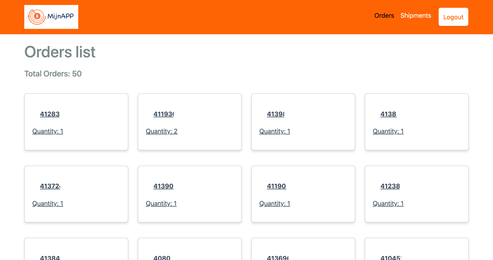
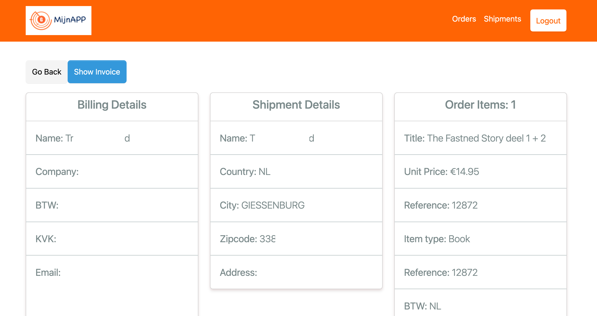

# Full Stack Invoice Automation App

## Explanation

This Full Stack Invoice Automation App streamlines the process of generating and sending invoices. Built with Node.js, Express, and React, the application automates data retrieval, invoice generation, and email dispatch to clients. The goal is to optimize and simplify the invoicing workflow, reducing manual effort and improving efficiency.

### Key Features

- **Data Retrieval**: Fetches data using Axios from a REST API, ensuring real-time and accurate information.
- **Invoice Generation**: 
  - **Backend**: Utilizes Puppeteer to generate invoices in PDF format.
  - **Frontend**: Leverages @react-pdf for client-side PDF generation and display.
- **Email Dispatch**: Integrates NodeMailer to automate email creation, attach generated invoices, and send them to clients.
- **User Interaction**: Provides an intuitive user interface with React-Bootstrap, allowing users to generate invoices and send them via email with just a few clicks.

### Technologies Used

- **Backend**:
  - **Node.js & Express**: For building the server and handling API requests.
  - **Puppeteer**: For server-side PDF invoice generation.
  - **Axios**: For making REST API calls to fetch data.
  - **NodeMailer**: For sending emails with attached invoices.
- **Frontend**:
  - **React**: For building a dynamic and responsive user interface.
  - **@react-pdf**: For generating and displaying PDF invoices on the client side.
  - **React-Bootstrap**: For styling and designing a user-friendly interface.

### How It Works

1. **Data Fetching**: The app fetches data from a specified REST API using Axios.
2. **Invoice Creation**: 
   - Users can generate invoices by triggering a process that utilizes Puppeteer on the backend or @react-pdf on the frontend.
   - The generated invoice is presented to the user in a PDF format.
3. **Email Sending**: 
   - Users have the option to send the generated invoice directly to their clients via email.
   - NodeMailer handles the email creation, attachment of the invoice, and sending process.

...

## Screenshots


*Caption: Login Page.*


*Caption: Home Page.*


*Caption: Orders/Shipments Page.*


*Caption: Single Order/Shipment Screen.*


*Caption: Single Order/Shipment with Pdf Invoice.*

...

## Getting Started

To get started with the app, follow these steps:

1. **Clone the Repository**:
   ```sh
   git clone https://github.com/hnnhack/full-stack-invoice-automation.git
   cd full-stack-invoice-automation
   ```

2. **Install Dependencies**:
  ```sh
  npm install
  cd frontend
  npm install
  ```
3. **Create .env file**:

Create `.env` file in the `root folder`. Example `.env` shown below
  ```sh
  PORT=5000
  ACCESS_URL="https://your-access-url"
  ACCESS_CREDENTIALS="your-creadentials-here"
  BASE_URL="https://your-base-url"
  PASS_CODE="YOURPASSCODE"
  ```
4. **Start the server**
  ```sh
  npm run server
  ```
5. **Start the Client**
  ```sh
  npm run client
  ```
6. **Start Full Stack Concurrently**
  ```sh
  npm run dev
  ```

## Contributing

### Guidelines for contributing to the project.

1. Fork the repository.
2. Create a new branch.
3. Make your changes.
4. Submit a pull request.

## Conclusion

This Full Stack Invoice Automation App is designed to save time and reduce errors in the invoicing process by automating data retrieval, invoice generation, and email dispatch. With a user-friendly interface and robust backend processes, managing invoices becomes a seamless experience.

## License

This project is licensed under the MIT License - see the LICENSE file for details.

